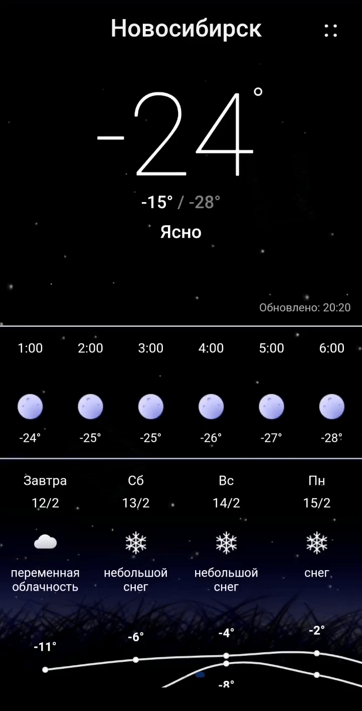
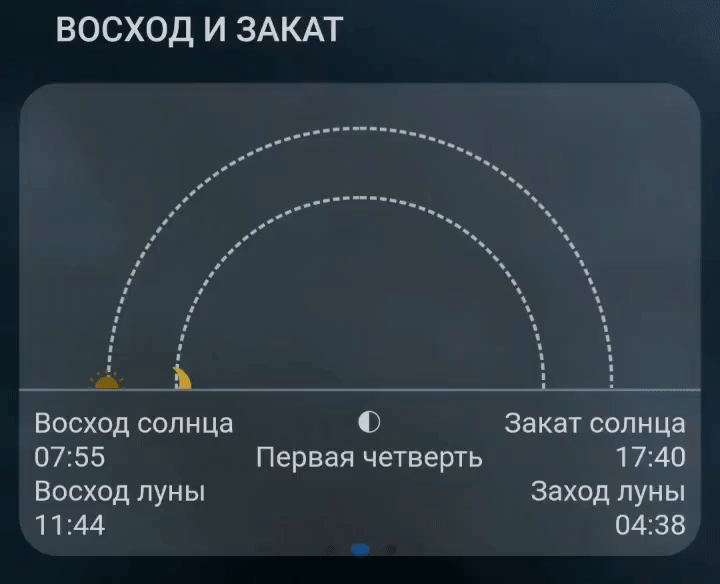

<h1 align="center">
 Weather Forecast
   
    
   
</h1>  

<h3 align="center">A typescript Weather Forecast app with awesome UI</h3>

   
  
 

### Basic Overview  
Weather Forecast app has never been so easy to use. It's quick and full of features.  

Forecastle
- forecast now
- hourly forecast
- daily forecast

Great features
- The weather channel: temperature, wind, humidity, atmosphere pressure, real feel and uv-index
- Animated weather conditions with live background images
- Daily weather chart with max/min temperature
- Detailed local forecast & weather forecast world wide
- Sun and moon animated phases

# Support
Please [open an issue](https://github.com/rodionbgd/weather/issues) for support or even more [open a pull request](https://github.com/rodionbgd/weather/pulls).

# License

 This project is open source. Enjoy using it.

# Contacts
Don't hesitate to ask me whatever you want. Stay tuned for more awesome projects :smile:. Follow me or Connect me via <a href="https://t.me/rodionbgd">Telegram</a>
